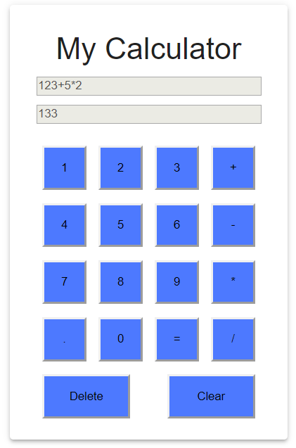

**my-calculator is a very simple calculator created using basic ReactJs. It supports basic mathematical operations such as addition, multiplication, subtraction and division.**

**Valid question pattern** - (operand) (operator) (operand)

**Examples :** 1+2, 3*4, 3-1/2

**Invalid question pattern -** (operand) (operator)

**Examples :** 1+2*, 08*2 (since cannot start with 0)

**Important points -**
1. Initially the operator buttons, equals button, delete and clear buttons are disabled because the first character that should be entered should be an operand.
2. If any invalid input is entered e.g. 5+2* then the output "Invalid input" error is shown on the "Your result" screen.
3. Delete button is used to delete the last character of the input.
4. Clear is used to clear the question.

**Note : The npm start script is configured to run on port 3006.**

This project was bootstrapped with [Create React App](https://github.com/facebook/create-react-app).

## Available Scripts

In the project directory, you can run:

### `npm start`

Runs the app in the development mode. 
Open [http://localhost:3006](http://localhost:3006) to view it in the browser.

